# ExpungementKokuaCE
This extension assesses whether a Hawaii criminal defendant's records can be expunged by examining case record pages on the state judiciary's eCourt Kokua site. After assessing case records, the expungement form and the letter to be sent to the appropriate administrative judge may be generated to request expungement of the defendant's records.

> [!IMPORTANT]
> This extension is intended as a professional tool to assist knowledgeable attorneys. Their expertise is required for any conclusive determination of expungement eligibility. The extension cannot account for all possible permutations of considerations bearing on whether records can be expunged. (See, for example, the section at the bottom of this Readme.) All recommendations regarding expungement made by this extension are necessarily provisional and do not constitute legal advice.

# How to use the extension
1. After installing the extension, navigate to the Hawaii State Judiciary's website at https://www.courts.state.hi.us and click "Search Court Cases," followed by "CLICK HERE to Enter eCourt* Kokua."
2. Click on "Party Search," fill out the search form, and click "Search." Alternatively, you can also search by Case ID by filling out and submitting the search form on the "Case Search" page.
3. If you used Party Search, you will see that the table of search results has a column at the far right called "Check Status." Rows of cases that the extension can check for expungement eligibility will have in this column "Need to Check" against a grey background.
4. Click on a case that can be checked to open the case record. Now open the extension popup by clicking on the pink and white eraser icon at the upper-right of the browser window to the right of the address bar. If you do not see this icon, you may need to pin it there by clicking on the puzzle piece, then on "Manage extensions" in the menu that appears, then on "Details" in the "Kokua Expungement" card among the extension cards that appear, and finally, by toggling to on the option called "Pin to toolbar". You should see the eraser icon appear to the right of the address bar. You may then close the Extensions tab and return to eCourt Kokua.
5. On the extension popup, click the blue "Check if Expungeable" button. The case record should appear in the popup's case table together with the extension's assessment of whether the case is eligible for expungement. In addition, on the case record page itself, you should see the extension's assessment of each charge. Hover the mouse cursor over the eligibility determination to see a brief popup explaining the assessment. For a more detailed explanation, click on the case number in the popup's case table to view information about the case. 
6. If you navigated to the case record page using "Party Search," you may return to the table of search results using the browser's back button. The case's grey "Need to Check" cell should now have changed to indicate the case's overall eligibility for expungement based on the assessment of each charge. This feature is unavailable if instead you found the case record page using "Case Search," assessments of all cases will remain available in the extension popup itself regardless of how you navigated to the case record page.
7. You may continue to assess cases by navigating to them either from the Party Search or Case Search pages (or both). Assessments will accumulate in the popup's case table.
8. When you are ready to generate expungement paperwork, click "Generate Documents." An pre-filled expungement form PDF and a Word document letter addressed to the appropriate administrative judge will be made available as file downloads. The form should be complete aside from blanks that require signatures or initials, as well as the blank for the defendant's social security number.
9. If you wish to change or add the name, address, or contact information used by the form and the letters, you can click on the "Defendant" header on the popup's case table. You can then fill out the relevant information. PLEASE NOTE: this assumes that the same person is the defendant in all cases assessed in the table, as the information for all defendants will be changed to what you input. DO NOT use this feature if you have used the extension to assess cases with different defendants.
10. To clear the cases assessed from the extension, click the red "Clear All Clients" button.

> [!NOTE]
> If the case has multiple defendants, the extension currently evaluates only the first.

# How the extension assesses expungement eligibility
The following flowcharts describe how the extension reasons from the disposition of the case and other relevant factors (e.g., the limitations period) to determine whether the case is or may be eligible for expungement.

## Non-convictions that may be eligible for expungement

## Convictions and other adverse judgments

## Ineligible non-convictions that the extension may not properly handle
> [!CAUTION] 
> The extension cannot account for the following records ineligible for expungement

**The extension may inaccurately show that such cases are eligible for expungement. Please take care to verify that the defendant's case is not characterized by one of these exceptions. See HRS § 831-3.2 for more information.**