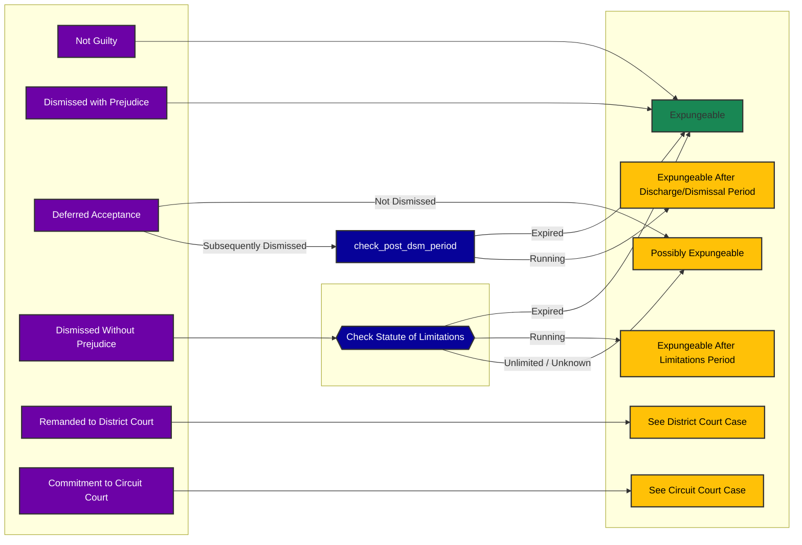

```mermaid
flowchart LR
    subgraph  
        direction LR
        disp_innocent[Not Guilty]
        disp_dsm_w_prej[Dismissed with Prejudice]
        disp_defer_accept[Deferred Acceptance]
        disp_without_prej[Dismissed Without Prejudice]
        disp_remand[Remanded to District Court]
        disp_commit[Commitment to Circuit Court]
    end

    subgraph  
        assess_expunge[Expungeable]

        assess_possibly_expunge[Possibly Expungeable]
        assess_expunge_post_dsm[Expungeable After Discharge/Dismissal Period]
        assess_expunge_post_sol[Expungeable After Limitations Period]
        assess_see_district[See District Court Case]
        assess_see_circuit[See Circuit Court Case]
    end


    subgraph  
        check_sol_period{{Check Statute of Limitations}}
    end


    disp_innocent --> assess_expunge
    disp_dsm_w_prej --> assess_expunge

    disp_remand --> assess_see_district[See District Court Case]
    disp_commit --> assess_see_circuit[See Circuit Court Case]

    disp_without_prej --> check_sol_period{{Check Statute of Limitations}}
    check_sol_period -->|Expired| assess_expunge
    check_sol_period -->|Running| assess_expunge_post_sol
    check_sol_period -->|Unlimited / Unknown| assess_possibly_expunge


    disp_defer_accept -->|Not Dismissed| assess_possibly_expunge
    disp_defer_accept -->|Subsequently Dismissed| check_post_dsm_period
    check_post_dsm_period -->|Expired| assess_expunge
    check_post_dsm_period -->|Running| assess_expunge_post_dsm

    classDef expungeable fill:#198754,stroke:#333,stroke-width:2px;
    classDef not_expungeable fill:#f08080,stroke:#333,stroke-width:2px,color:#000000;
    classDef possibly_expungeable fill:#ffc107,stroke:#333,stroke-width:2px,color:#000000;
    classDef orange fill:#ed7117,stroke:#333,stroke-width:2px,color:#000;
    classDef blue fill:#070299,stroke:#333,stroke-width:2px,color:#fff;
    classDef red fill:#AA4A44,stroke:#333,stroke-width:2px,color:#fff,font-weight:bold;
    classDef warning fill:#ff0000,stroke:#333,stroke-width:2px,color:#fff;
    classDef disposition fill:#6c02a6,stroke:#333,stroke-width:2px,color:#fff;

    class assess_expunge expungeable;
    class assess_not_expunge not_expungeable;
    class assess_possibly_expunge,assess_expunge_post_dsm,assess_expunge_post_sol,assess_see_district,assess_see_circuit,assess_expunge_21,assess_1st_expunge,assess_1st_2nd_expunge possibly_expungeable;
    class B,J,check_post_dsm_period,check_sol_period,check_post_2004 blue;
    class offense_minor_DUI,offense_prop,offense_drug,offense_other red;
    class inelig_felony_skipped_bail,inelig_p_misd_viol_skipped_bail,inelig_left_town,inelig_hospital,inelig_unfit orange;
    class disp_innocent,disp_dsm_w_prej,disp_defer_accept,disp_guilty,disp_without_prej,disp_default,disp_remand,disp_commit,disp_nonconvict_inelig disposition;
    class undetected warning;
```