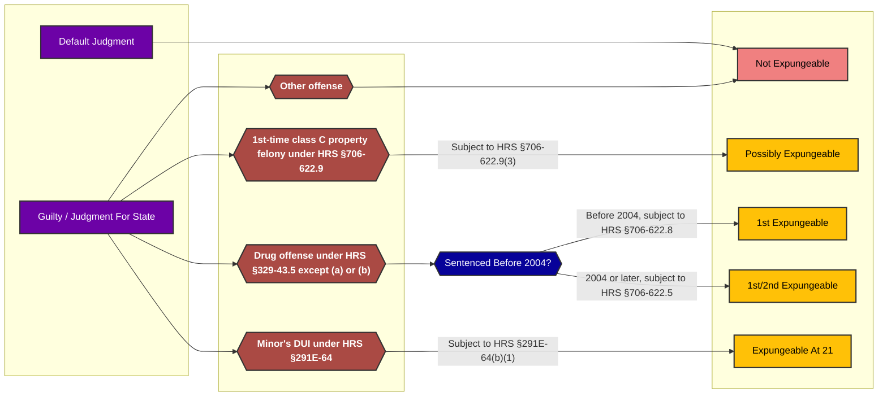

```mermaid
flowchart LR
        direction LR
    subgraph  
        disp_default[Default Judgment]
        disp_guilty[Guilty / Judgment For State]
    end

    subgraph  
        assess_not_expunge[Not Expungeable]
        assess_possibly_expunge[Possibly Expungeable]
        assess_1st_expunge[1st Expungeable]
        assess_1st_2nd_expunge[1st/2nd Expungeable]
        assess_expunge_21[Expungeable At 21]
    end

    subgraph  
        offense_minor_DUI{{"Minor's DUI under HRS §291E-64"}}
        offense_prop{{"1st-time class C property felony under HRS §706-622.9"}}
        offense_drug{{"Drug offense under HRS §329-43.5 except (a) or (b)"}}
        offense_other{{Other offense}}
    end  

    disp_guilty --> offense_minor_DUI
    disp_guilty --> offense_prop
    disp_guilty --> offense_drug
    disp_guilty --> offense_other
    disp_default --> assess_not_expunge[Not Expungeable]


    offense_minor_DUI -->|"Subject to HRS §291E-64(b)(1)"| assess_expunge_21
    offense_prop -->|"Subject to HRS §706-622.9(3)"| assess_possibly_expunge
    offense_drug --> check_post_2004{{Sentenced Before 2004?}}
    offense_other -->assess_not_expunge


    check_post_2004 -->|"Before 2004, subject to HRS §706-622.8"|assess_1st_expunge
    check_post_2004 -->|"2004 or later, subject to HRS §706-622.5"|assess_1st_2nd_expunge


    classDef expungeable fill:#198754,stroke:#333,stroke-width:2px;
    classDef not_expungeable fill:#f08080,stroke:#333,stroke-width:2px,color:#000000;
    classDef possibly_expungeable fill:#ffc107,stroke:#333,stroke-width:2px,color:#000000;
    classDef orange fill:#ed7117,stroke:#333,stroke-width:2px,color:#000;
    classDef blue fill:#070299,stroke:#333,stroke-width:2px,color:#fff;
    classDef red fill:#AA4A44,stroke:#333,stroke-width:2px,color:#fff,font-weight:bold;
    classDef warning fill:#ff0000,stroke:#333,stroke-width:2px,color:#fff;
    classDef disposition fill:#6c02a6,stroke:#333,stroke-width:2px,color:#fff;

    class assess_expunge expungeable;
    class assess_not_expunge not_expungeable;
    class assess_possibly_expunge,assess_expunge_post_dsm,assess_expunge_post_sol,assess_see_district,assess_see_circuit,assess_expunge_21,assess_1st_expunge,assess_1st_2nd_expunge possibly_expungeable;
    class B,J,check_post_dsm_period,check_sol_period,check_post_2004 blue;
    class offense_minor_DUI,offense_prop,offense_drug,offense_other red;
    class inelig_felony_skipped_bail,inelig_p_misd_viol_skipped_bail,inelig_left_town,inelig_hospital,inelig_unfit orange;
    class disp_innocent,disp_dsm_w_prej,disp_defer_accept,disp_guilty,disp_without_prej,disp_default,disp_remand,disp_commit,disp_nonconvict_inelig disposition;
    class undetected warning;
```