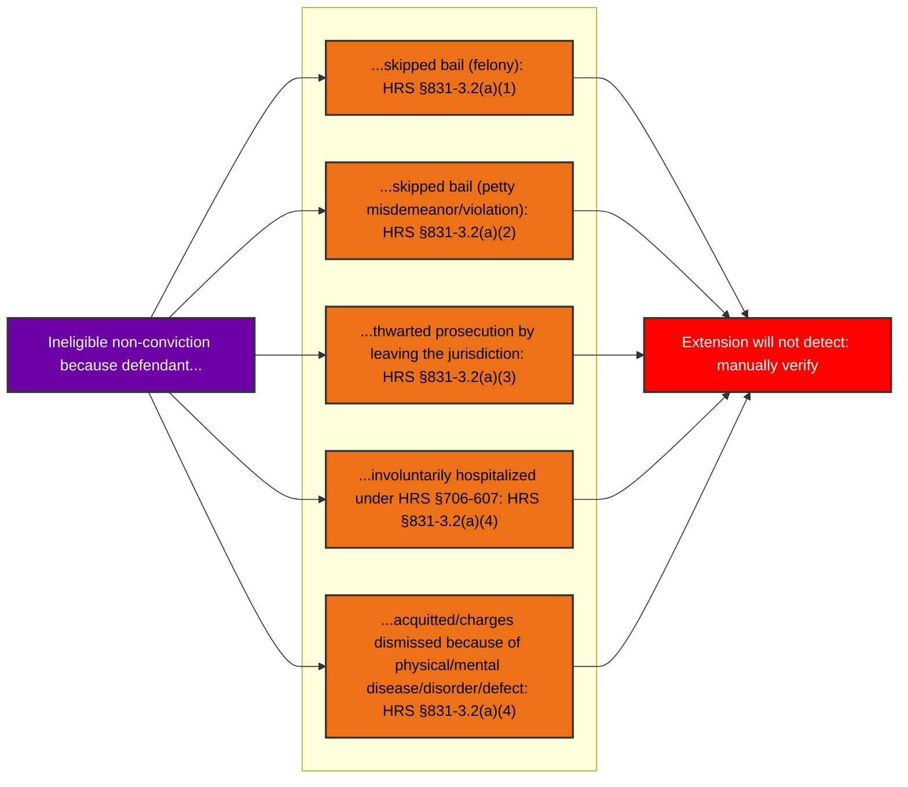

```mermaid
flowchart LR
        disp_nonconvict_inelig["Ineligible non-conviction because defendant..."]
    
    subgraph  
        inelig_felony_skipped_bail["...skipped bail (felony): HRS §831-3.2(a)(1)"]
        inelig_p_misd_viol_skipped_bail["...skipped bail (petty misdemeanor/violation): HRS §831-3.2(a)(2)"]
        inelig_left_town["...thwarted prosecution by leaving the jurisdiction: HRS §831-3.2(a)(3)"]
        inelig_hospital["...involuntarily hospitalized under HRS §706-607: HRS §831-3.2(a)(4)"]
        inelig_unfit["...acquitted/charges dismissed because of physical/mental disease/disorder/defect: HRS §831-3.2(a)(4)"]
    end  

    disp_nonconvict_inelig --> inelig_felony_skipped_bail & inelig_p_misd_viol_skipped_bail & inelig_left_town & inelig_hospital & inelig_unfit 
    inelig_felony_skipped_bail & inelig_p_misd_viol_skipped_bail & inelig_left_town & inelig_hospital & inelig_unfit --> undetected[Extension will not detect: manually verify]

    classDef expungeable fill:#198754,stroke:#333,stroke-width:2px;
    classDef not_expungeable fill:#f08080,stroke:#333,stroke-width:2px,color:#000000;
    classDef possibly_expungeable fill:#ffc107,stroke:#333,stroke-width:2px,color:#000000;
    classDef orange fill:#ed7117,stroke:#333,stroke-width:2px,color:#000;
    classDef blue fill:#070299,stroke:#333,stroke-width:2px,color:#fff;
    classDef red fill:#AA4A44,stroke:#333,stroke-width:2px,color:#fff,font-weight:bold;
    classDef warning fill:#ff0000,stroke:#333,stroke-width:2px,color:#fff;
    classDef disposition fill:#6c02a6,stroke:#333,stroke-width:2px,color:#fff;

    class assess_expunge expungeable;
    class assess_not_expunge not_expungeable;
    class assess_possibly_expunge,assess_expunge_post_dsm,assess_expunge_post_sol,assess_see_district,assess_see_circuit,assess_expunge_21,assess_1st_expunge,assess_1st_2nd_expunge possibly_expungeable;
    class B,J,check_post_dsm_period,check_sol_period,check_post_2004 blue;
    class offense_minor_DUI,offense_prop,offense_drug,offense_other red;
    class inelig_felony_skipped_bail,inelig_p_misd_viol_skipped_bail,inelig_left_town,inelig_hospital,inelig_unfit orange;
    class disp_innocent,disp_dsm_w_prej,disp_defer_accept,disp_guilty,disp_without_prej,disp_default,disp_remand,disp_commit,disp_nonconvict_inelig disposition;
    class undetected warning;
```